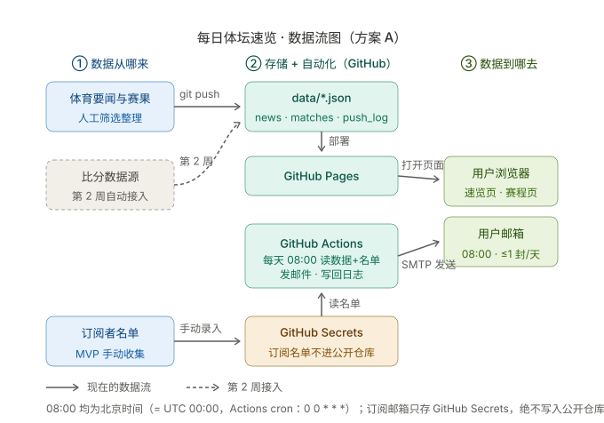

# 每日体坛速览 · 技术设计（TECH_DESIGN）

| 项目   | 内容                                                         |
| ---- | ---------------------------------------------------------- |
| 产品名称 | 每日体坛速览                                                   |
| 文档版本 | v1.3（v1.0 2026-09-22 初稿 → v1.1 2026-09-23 按确认限制定稿：QQ 邮箱 SMTP、人工退订、订阅名单入配置、新增数据源候选清单 → v1.2 三大类导航筛选落地：前端过滤，不影响架构与数据流 → v1.3 同日：确认「本地录入表单」生成 JSON，人工终审保留） |
| 撰写日期 | 2026-09-22，v1.1 定稿 2026-09-23（Day 5｜第 1 周）                 |
| 作者   | learner                                                    |
| 上游文档 | PRD.md（Day 4，v1.1）· research.md（Day 3）                     |
| 文档边界 | 只定技术方案：前后端分工、技术路线、数据流与运维约定；**不含任何代码实现**（Day 6–7 才开发）        |

## 0. 一句话总结（数据从哪来、到哪去）

> **数据从「人工筛选的体育要闻/官方赛果 + 手动收集的订阅名单」来，存在 GitHub 仓库的 JSON 文件与 Secrets 里；页面数据经 GitHub Pages 到用户浏览器，每日速览经 GitHub Actions 定时任务渲染成邮件、经 QQ 邮箱 SMTP 到用户邮箱，发送结果写回仓库留痕。**

数据流图见第 6 节（`docs/dataflow.svg`）。

## 1. 前后端与数据库分工（方案 A 视角）

| 角色   | 本项目由谁承担                     | 说明                                                                 |
| ---- | --------------------------- | ------------------------------------------------------------------ |
| 前端   | 原生 HTML/CSS/JS 静态页（P1–P2 两页） | 负责**全部**用户可见渲染：速览四板块、赛程切换；数据来自 `fetch` JSON 文件                     |
| 后端   | **没有传统后端**                  | 「服务端逻辑」由两个 GitHub 机制代替：① Pages 负责托管分发；② Actions 定时任务负责每天渲染邮件并调用 SMTP |
| 数据库  | JSON 文件 + Git 仓库            | `data/*.json` 就是数据库；**git 历史就是版本管理**——比分更正留痕、条目不静默删除，直接由提交历史满足（PRD 第 6 节数据规则） |
| 密钥存储 | GitHub Secrets              | SMTP 授权码、订阅名单等敏感信息，永不进公开仓库（.env 仅本地调试，已被 .gitignore 忽略）             |

一句话：**前端干渲染，Actions 干定时活，Git 干数据库的活**。没有任何一台需要养的服务器，笔记本关机不影响任何线上环节。

## 2. 技术路线：方案比较与推荐

### 2.1 两个候选方案

- **方案 A：纯静态 + GitHub 自动化**——原生三件套页面，数据为 `data/*.json`，托管 GitHub Pages，定时邮件用 GitHub Actions（cron）+ QQ 邮箱免费 SMTP，订阅名单存 Secrets（配置形态）。
- **方案 B：轻后端**——Node.js（Express）+ SQLite 数据库，部署到免费 PaaS（如 Render 免费档），订阅/退订做成真实 API 表单。

### 2.2 五维比较（第 5 维为 2026-09-23 确认的约束匹配度）

| 比较维度   | 方案 A（纯静态 + Actions）                                                               | 方案 B（Express + SQLite）                                                            |
| ------ | --------------------------------------------------------------------------------- | --------------------------------------------------------------------------------- |
| **学习成本** | 低：只在我已会的 HTML/JS 上新增两样——手写 JSON、一个发邮件脚本 + Actions 配置文件。无新框架、无新运行时概念                    | 中高：新增 HTTP 服务与路由、数据库读写、部署平台配置、环境变量管理四块知识，Day 6–7 两天写不完第一版，挤压每天仅 1–2 小时的预算               |
| **线上持久化** | 强：数据即仓库文件，天然版本化、永不丢；「更正留痕」由 git 历史直接满足（PRD 6 数据规则）。订阅名单存 Secrets，MVP 手动维护                        | 弱（免费档）：Render 免费实例的文件系统在重启/重新部署后清空，**SQLite 文件会丢**；要持久必须付费挂盘（需绑卡）或接外部数据库（需新账号）       |
| **费用**   | **0 元**：Pages/Actions 公开仓库免费、QQ 邮箱 SMTP 免费、域名用 github.io 子域（额度以官方页面为准，MVP 用量远低于上限）    | 0 元起但有隐患：免费档 15 分钟无访问即休眠（首访慢 30 秒+）；解决休眠与持久化要付费或再注册外部数据库账号                            |
| **排错难度** | 小：错误只有两处可看——浏览器控制台（页面）与 Actions 日志（推送），均可一键重跑；笔记本关机不影响任何线上任务                          | 长：本地能跑线上跑不了（端口/环境变量）、数据库文件锁、平台构建失败、休眠被误判为故障，每一环都要学怎么查                                 |
| **匹配你的限制** | ✅ 不需要 24 小时开机的电脑；✅ 每天人工只做「表单录入 → push」（约 10 分钟，v1.3 起 tools/entry.html 生成 JSON，不手写字段）+ 选内容，其余全自动；✅ 零新账号（GitHub 已有 + QQ 邮箱）；✅ 全程免费不用绑卡 | ❌ 至少注册 PaaS 一个新账号，持久化可能再加一个；⚠ 免费档要么忍休眠要么绑卡付费；⚠ 退订表单自动化是 B 的独有优势——但你已确认接受人工退订，此优势作废       |

### 2.3 推荐：方案 A（基于 2026-09-23 确认的 6 条约束）

1. **电脑**：笔记本不 24 小时开机 → 方案 A 的所有定时/存储/托管都在 GitHub 云端，本机只做编辑与 push，关机零影响；
2. **时间（每天 1–2 小时）**：技术链路全自动——数据校验、邮件渲染、SMTP 发送、日志写回全由 Actions 完成；人工只保留两件事：选内容（PRD 9.3 的 15–30 分钟终审）+ 表单录入后 push（约 10 分钟；v1.3 确认经 tools/entry.html 生成/追加 JSON，不手写字段），无复杂审核环节；
3. **账号**：零新增——GitHub 复用，发件用现有 QQ 邮箱开一次 SMTP 授权码（一次性设置，不是注册新账号）；完全免费，无需绑卡；
4. **订阅名单**：你已确认手动收集、放 Secrets 可接受 → 不需要数据库；
5. **退订**：你已确认回复邮件人工退订 → 方案 B 唯一的优势（全自动订阅/退订表单）在本 MVP 用不上，B 再无一票必选理由。

**留了后路**：第 5 节 API 契约按 REST 预留，将来订阅人数多了迁方案 B（或数据库），前端几乎不用改（触发条件与步骤见第 10 节）。

### 2.4 技术路线（一句话）

> **GitHub Pages 静态站 + data/*.json 数据文件 + GitHub Actions 每天 08:00 定时邮件（QQ 邮箱 SMTP）——零服务器、零费用、零新增账号、笔记本关机不影响运行；订阅手动收集、退订回复邮件人工处理，人多后再迁数据库（触发条件见第 10 节）。**

## 3. 项目结构（目标形态，Day 6–7 逐步搭出）

```
28days/
├── index.html              # P1 每日速览页（现 Day 1 旧四栏页，Day 6 起按 PRD 改造）
├── matches.html            # P2 赛程比分页
├── unsubscribe.html        # 暂不开发（v1.1 确认：回复邮件人工退订；保留文件名占位）
├── css/style.css           # 共用样式（移动端优先，PRD 验收 10.1-5）
├── js/
│   ├── app.js              # 首页：fetch news.json → 按日期过滤 → 渲染四板块
│   └── matches.js          # 赛程页：fetch matches.json → 昨天/今天/明天切换 → 渲染
├── data/
│   ├── news.json           # 速览条目（第 4 节 4.1）
│   ├── matches.json        # 比赛数据（4.2）
│   └── push_log.json       # 推送记录（4.4，由 Actions 每日写回提交）
├── scripts/
│   └── send_digest.mjs     # Actions 调用：校验数据 → 渲染邮件 HTML → SMTP 发送 → 写 push_log
├── tools/
│   └── entry.html          # 本地录入表单（Day 6 建）：填字段 → 生成/追加 JSON → 字段校验（≤30/≤60 字）
├── .github/workflows/
│   └── daily-push.yml      # 定时任务：cron 0 0 * * *（UTC 00:00 = 北京 08:00）
├── docs/
│   └── dataflow.svg        # 数据流图（本技术设计的第 6 节）
├── research.md / PRD.md / TECH_DESIGN.md / README.md
└── .env                    # 本地调试密钥（已 gitignore，永不提交）
```

## 4. 数据对象及字段（JSON 存储形态）

> 字段与 PRD 第 6 节一一对应，仅补充存储约定。时间统一存北京时间字符串 `YYYY-MM-DD HH:mm`；`created_at` 等系统时间用完整 ISO 8601。id 用可读前缀：日期 + 序号。

### 4.1 news_item（存 data/news.json，数组）

| 字段          | 类型     | 要求                            |
| ----------- | ------ | ----------------------------- |
| id          | string | 必填，规则 `YYYYMMDD-n01`          |
| title       | string | 必填，≤30 字                      |
| summary     | string | 必填，≤60 字，含背景/影响/后续之一          |
| section     | string | 必填，四选一：头条 / 转会伤病 / 热议 / 明日看点  |
| league      | string | 必填：NBA / 英超 / 中超 / 欧冠 / 电竞 / 综合 |
| source_name | string | 必填                            |
| source_url  | string | 必填，可访问 URL                    |
| digest_date | string | 必填，`YYYY-MM-DD`               |
| status      | string | 必填：draft / published（仅 published 对用户可见） |
| created_at  | string | 必填，ISO 8601                   |

### 4.2 match（存 data/matches.json，数组）

| 字段                | 类型     | 要求                        |
| ----------------- | ------ | ------------------------- |
| id                | string | 必填，规则 `YYYYMMDD-<联赛>-01`（如 20260922-epl-01） |
| league            | string | 必填（MVP 仅 NBA / 英超）        |
| home_team / away_team | string | 必填                    |
| match_time        | string | 必填，北京时间 `YYYY-MM-DD HH:mm` |
| status            | string | 必填：未开始 / 进行中 / 已结束 / 延期 / 取消 |
| home_score / away_score | number | 已结束后必填，与官方结果一致        |
| round / venue     | string | 选填                        |
| data_source       | string | 必填，比分来源（用于核对溯源，PRD 9.2）   |
| updated_at        | string | 必填，ISO 8601，页面对用户展示       |

### 4.3 subscriber（**不存公开仓库**，存 GitHub Secrets 的 SUBSCRIBERS_JSON）

> v1.1 确认：前期手动收集（朋友把邮箱发给你 → 你录入此配置），人多后再迁数据库（触发条件见第 10 节）。

| 字段                | 类型     | 要求                      |
| ----------------- | ------ | ----------------------- |
| id                | string | 必填，s001 递增              |
| email             | string | 必填，全局唯一                 |
| status            | string | 必填：subscribed / unsubscribed（人工退订 = 你手动把状态改为 unsubscribed） |
| subscribed_at     | string | 必填，ISO 8601             |
| unsubscribe_token | string | 必填，随机不可猜测（为将来自动化预留，人工阶段可不生成） |
| last_sent_at      | string | 自动记录                    |

### 4.4 push_log（存 data/push_log.json，由 Actions 追加写回）

| 字段              | 类型     | 要求               |
| --------------- | ------ | ---------------- |
| id              | string | 必填，`YYYYMMDD-push` |
| digest_date     | string | 必填               |
| sent_at         | string | 必填               |
| recipient_count | number | 必填               |
| status          | string | 必填：成功 / 部分失败 / 失败 |
| failure_note    | string | 状态非「成功」时必填       |

**数据规则**（沿 PRD，落到本方案的动作）：已发布条目不静默删除（更正 = 改 JSON 重新 push，git 历史即留痕）；(email, digest_date) 唯一（发送脚本先查 push_log/last_sent_at 防重）；比分修改必须更新 updated_at。发布前脚本校验必填字段与字数上限（≤30/≤60），不合格则 Actions 报错、当天不发邮件；league→大类映射（篮球=NBA/CBA，足球=英超/中超/欧冠，综合=电竞及其他）硬编码在前端，保证导航筛选可用。

## 5. API 列表（MVP 无自建后端：静态数据契约 + 预留 REST）

### 5.1 MVP 实际使用的数据接口

| #  | 接口                              | 提供方          | 参数/过滤                       | 返回                          | 服务页面  |
| -- | ------------------------------- | ------------ | --------------------------- | --------------------------- | ----- |
| 1  | GET `/data/news.json`           | GitHub Pages 静态文件 | 前端过滤：digest_date = 今天 且 status = published | news_item 数组            | P1 首页 |
| 2  | GET `/data/matches.json`        | 同上           | 前端过滤：match_time 日期 ∈ 昨天/今天/明天 | match 数组                   | P2 赛程 |
| 3  | 读 `data/*.json` + SUBSCRIBERS_JSON | Actions 运行环境 | 当天日期                        | 生成邮件 HTML + 更新 push_log     | F3 推送 |
| 4  | 退订（人工流程）                        | 邮件回复 → 你手动处理 | —                           | 将 SUBSCRIBERS_JSON 中该用户 status 改为 unsubscribed | F3 退订 |

### 5.2 预留 REST 契约（迁方案 B 时实现，形状不变前端少改）

| # | 契约                    | 方法   | 参数              | 成功返回           | 错误码                  |
| - | --------------------- | ---- | --------------- | -------------- | -------------------- |
| 5 | `/api/news`           | GET  | `?date=YYYY-MM-DD` | `{code:0, data:[...]}` | 400 参数错 / 404 无数据 |
| 6 | `/api/matches`        | GET  | `?date=YYYY-MM-DD` | 同上             | 同上                   |
| 7 | `/api/subscribe`      | POST | body `{email}`  | `{code:0}`     | 400 格式错 / 409 已订阅    |
| 8 | `/api/unsubscribe`    | GET  | `?token=...`    | `{code:0}`     | 400 令牌无效             |

约定：响应包络 `{code, message, data}`；`code=0` 成功；错误码用 HTTP 语义（400/404/409/500）。MVP 阶段 5/6 由「静态 JSON + 前端过滤」模拟，7/8 由人工流程代替（第 11 节）。

## 6. 数据流



分步说明（与图对应）：

1. **内容线（每天）**：人工从官方/权威来源筛选 6–12 条要闻与比分（PRD 9.3：终审 15–30 分钟）→ 经 `tools/entry.html` 表单录入、生成/追加 JSON（v1.3，不手写字段）→ `git push`；
2. **页面线（用户访问）**：push 触发 Pages 自动部署 → 用户浏览器打开 P1/P2 → JS `fetch` JSON → 按日期、状态与导航大类筛选 → 渲染四板块速览与三天赛程；
3. **订阅线（MVP 手动）**：朋友发来邮箱 → 录入 Secrets 中的 SUBSCRIBERS_JSON（含退订令牌）；
4. **推送线（每天 08:00±）**：Actions 定时触发 → 读三个数据源（news/matches/Secrets）→ 校验当天有已发布内容 → 渲染邮件 HTML → 经 QQ 邮箱 SMTP 发送（每用户 ≤1 封）→ 把结果追加进 `data/push_log.json` 并 commit 回仓库（留痕）。

## 7. 错误处理

| 环节     | 故障情形            | 用户看到什么       | 系统动作（对齐 PRD）                          |
| ------ | --------------- | ------------ | ------------------------------------- |
| 页面加载   | JSON fetch 失败/超时 | 「加载失败，请刷新重试」占位 | console.warn 记录；不白屏（10.1-1 不受影响时仍显示日期等静态部分） |
| 页面渲染   | 单条数据缺必填字段       | 跳过该条，其余正常    | console.warn 指明 id；发布前校验从源头挡住          |
| 空内容    | 某板块当天无条目        | 「今日暂无重大动态」   | 不报错不空白（PRD A4）；无比赛日显示「当日无重点赛事」        |
| 发布校验   | JSON 不合格（超字数/缺字段） | —（用户不可见）   | Actions 报错红 X；**当天不发邮件**（PRD C5：不发空邮件） |
| 邮件发送   | SMTP 失败/部分失败    | —            | push_log 记「失败/部分失败 + failure_note」；部分失败仅补发失败者；按 (email, date) 幂等防重发 |
| 比分错误   | 数据源或人工录入错误      | 页面显示更正后比分    | 当日改 JSON 重新 push，git 历史留痕（PRD 9.2）    |
| 定时偏差   | Actions cron 延迟  | 邮件晚到 0–15 分钟 | 第 1 周实测达标情况（PRD 08:00±15 分钟），不满足则把 cron 提前 |
| 人工退订遗漏 | 回复了退订但忘记改配置     | 用户多收 1 封     | 每次发送前核对 SUBSCRIBERS_JSON 状态；把「处理退订」写进每日流程清单 |
| 密钥泄漏风险 | 误把 .env 提交      | —            | .gitignore 已拦截；铁律：Secrets 只配在 GitHub 后台 |

## 8. 环境变量

| 变量               | 用途                        | 存放位置                        |
| ---------------- | ------------------------- | --------------------------- |
| SMTP_HOST        | SMTP 服务器地址：**smtp.qq.com（已确认 QQ 邮箱）** | GitHub Secrets + 本地 .env    |
| SMTP_PORT        | 端口（QQ 邮箱 SSL 用 465）       | 同上                          |
| SMTP_USER        | 发件邮箱：**2942595510@qq.com（已确认）** | 同上（非密钥，但统一定义在此）      |
| SMTP_PASS        | QQ 邮箱 SMTP **授权码**（不是 QQ 登录密码） | 同上（敏感）                 |
| SITE_URL         | 站点地址，邮件里「查看完整版」链接用        | 同上                          |
| SUBSCRIBERS_JSON | 订阅名单（4.3 数组的 JSON 字符串）    | 仅 GitHub Secrets；本地调试临时放 .env |

约定：`.env` 已被 .gitignore 忽略，只作本地调试；线上一切以 GitHub Secrets 为准（Settings → Secrets and variables → Actions）。**授权码与订阅者邮箱永不写入公开仓库的任何文件**（发件邮箱本身会出现在邮件 From 中，可公开；授权码绝不行）。

## 9. 部署注意事项

1. **Pages 开启**：仓库 Settings → Pages → Source 选 `main` 分支 `/ (root)`；此后每次 push 自动部署，地址形如 `https://<用户名>.github.io/28days/`——**SITE_URL 必须与它一致**，否则邮件里的「查看完整版」404；
2. **定时任务时区**：Actions cron 只有 UTC——北京 08:00 = `cron: 0 0 * * *`；cron 实际触发有 0–15 分钟级延迟，第一周每天记录实际发送时间，若超出 ±15 分钟就把 cron 调早（如 `55 23 * * *`）；
3. **QQ 邮箱 SMTP 授权码（一次性设置）**：QQ 邮箱网页版 → 设置 → 账户 → 开启「IMAP/SMTP 服务」→ 短信验证 → 生成 16 位授权码 → 填入 GitHub Secret `SMTP_PASS`（拿到后别存本地明文、别发给别人）；
4. **Secrets 配置清单**：第 8 节 6 个变量全部在 GitHub 后台配置；
5. **公开仓库纪律**：任何真实订阅者邮箱、授权码不得出现在仓库任何文件、issue、截图里（发件邮箱除外）；
6. **失败可观测**：Actions 每次运行的成败在 Actions 页可见，push_log.json 沉淀在仓库里，每周核对一次「连续 14 天断更 ≤ 1 次」（PRD 目标 1）。

## 10. 迁移注意事项（方案 A → 方案 B/数据库 的路线）

**触发条件（满足任一才迁，不提前造）**：

1. 订阅人数超出 Secrets 配置的可维护规模（经验值 ~100 人，或手动维护名单每月超过 10 分钟）；
2. 全自动订阅表单 / 即时退订成为真实需求（你愿意为此注册新账号/付费时）；
3. 比分数据源要求服务端代理隐藏 API key，或其使用条款要求非静态引用。

**迁移步骤（数据零丢失）**：

1. 写一次性导入脚本：`data/*.json` + SUBSCRIBERS_JSON → SQLite 表（第 4 节字段一一映射，**id 不变**，git 历史即迁移前备份）；
2. 按第 5.2 节预留契约实现 `/api/*`，前端把 fetch 的 JSON 路径换成 API 路径（包络形状一致，改动最小）；
3. 订阅名单导入 subscriber 表，退订链接改指向 `/unsubscribe?token=`（届时再开发 P3 页面）；
4. SMTP 五个环境变量原样搬到新平台的环境变量配置，Actions 的 send_digest 改由后端定时器（或保留 Actions）触发。

## 11. 已确认约束记录（2026-09-23，本文档 v1.1 的依据）

| # | 约束     | 确认内容                                 | 落在文档哪里    |
| - | ------ | ------------------------------------ | --------- |
| 1 | 电脑/环境  | 无云服务器；普通笔记本、不可能 24 小时开机；主要靠 GitHub Actions 等免费平台托管与跑定时任务 | 第 1、2.3、9 节 |
| 2 | 时间     | 每天 1–2 小时；前期尽可能自动化，不引入复杂人工审核         | 第 2.2/2.3 节 |
| 3 | 账号     | 不注册新账号；用现有 QQ 邮箱开 SMTP 授权码；愿绑卡但尽量完全免费 | 第 2.2/8/9 节 |
| 4 | 发件邮箱   | QQ 邮箱 2942595510@qq.com（本人去开授权码）      | 第 8 节      |
| 5 | 订阅名单   | 前期手动收集、放配置（Secrets）可接受；人多再上数据库         | 第 4.3/10 节 |
| 6 | 退订     | 最简版：回复邮件人工退订；先不开发退订页面                  | 第 3/5.1/7 节 |

**与 PRD 的冲突提示（留给你决定，本档不擅自改 PRD）**：PRD 验收 10.3-3 要求「点击退订并确认后页面显示已退订」（依赖 P3 退订页）；按本次确认的人工退订方案，该验收项延后。建议第 2 周回顾时把 PRD 退订条目改为「回复邮件退订（人工），自动化退订按技术设计第 10 节触发条件推进」。

## 12. 第 2 周免费数据源候选清单（v1.1 新增，条款均待核实后才能接入）

> 按你的约束过滤：尽量免注册、免费、可自动化。**下列均基于公开常识列举，可用性、配额与使用条款接入前必须逐个核实**（PRD 9.1 本就要求如此）。

| #  | 候选                          | 覆盖            | 形式          | 费用/注册            | 主要风险（待核实）                          |
| -- | --------------------------- | ------------- | ----------- | ---------------- | ---------------------------------- |
| 1  | openfootball 等开源体育数据项目       | 英超等足球赛程/部分赛果   | GitHub 开源数据文件（JSON/CSV） | 免费、无需注册           | 社区维护更新不及时；具体开源许可逐仓库核对              |
| 2  | 人工兜底：官方渠道（联赛官网/官方 App/权威体育媒体）人工核对后录入 | NBA+英超全量   | 人工           | 免费、无需注册           | 每天多花 10–20 分钟；但 PRD 9.2 本就要求人工核对，属流程内成本 |
| 3  | TheSportsDB                 | 多联赛赛程/比分/球队图库  | REST API     | 免费档（key 获取方式需核实）  | 社区数据质量一般；免费档可能有署名/频控条款              |
| 4  | 非官方 RSS 桥（如 RSSHub 公共实例）     | 虎扑/懂球帝等中文体育源   | RSS          | 免费、无需注册           | 公共实例不稳定；抓取第三方站点的条款风险最高              |
| 5  | NBA 官方 stats 站点接口（stats.nba.com） | 仅 NBA 全量数据    | 非官方公开 HTTP 接口 | 免费、无需注册           | 无官方文档、条款灰区、有反爬，随时可能失效——只列不作首选       |
| 6  | football-data.org / API-Sports 等免费 API 档 | 英超/NBA 结构化赛程比分 | REST API    | 免费档有配额；**需注册**（与约束 3 冲突） | 免费档配额（如 10–100 次/天）是否够用；商用限制条款       |

**建议核实顺序**：1 → 2（MVP 前几天本来就要人工录入，边录边攒数据）→ 3 → 4 → 5/6。**决策标准**：免注册 + 条款允许本项目「标题+摘要+链接」式展示（比分需允许展示结果数据）→ 可自动接入；否则退回人工兜底（2），它零风险且 PRD 流程已包含。

## 13. Day 5 完成标准自查

| 完成标准           | 对应位置        |
| -------------- | ----------- |
| TECH_DESIGN.md 已入库 | v1.0 随 Day 5 首次提交（94343a4），v1.1 按确认约束定稿 |
| 技术路线有理由        | 第 2 节（五维比较 + 对齐 6 条确认约束的推荐理由 + 一句话路线 2.4） |
| 数据流图能说清来去      | 第 6 节 `docs/dataflow.svg`（① 来源 ② 存储/自动化 ③ 去向，含第 2 周虚线预留） |
| 必含七节           | 项目结构(3) / 数据对象(4) / API(5) / 数据流(6) / 错误处理(7) / 环境变量(8) / 部署与迁移(9、10) |
| 今日不做           | 未写任何业务代码；未改 PRD 需求内容（退订与 PRD 10.3-3 的冲突在第 11 节如实标注，留你决定） |
