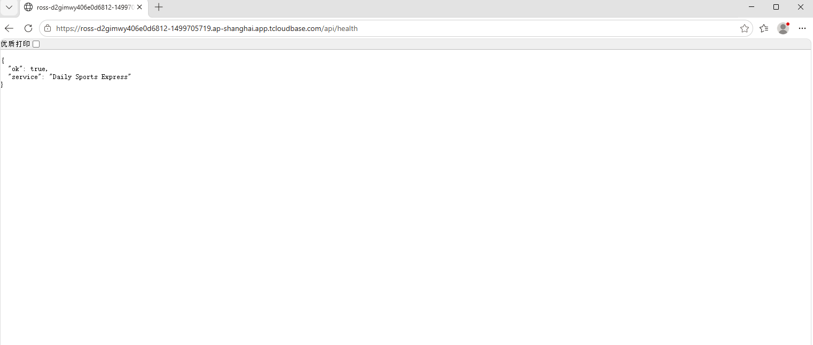

# Day 15 部署手册 · CloudBase 第一个云函数 + 前端静态托管

| 项目 | 内容 |
| ---- | ---- |
| 文档名称 | CloudBase 部署手册（注册开通 → health 云函数 → 前端托管） |
| 撰写日期 | 2026-10-03（Day 15｜第 3 周） |
| 对应任务 | 板块① 注册开通 CloudBase（附录 M）· 板块② /api/health 云函数 · 板块③ 前端 mock 版部署 |
| 今日边界 | **不做**：真实业务接口、数据库建表、跨域配置（属 Day 16–20） |
| 完成标准 | ① `/api/health` 公网可访问返回 JSON ② 前端公网页面同伴手机能打开 ③ `api-contract.md` 入库 |

## 实测结果（2026-10-03 21:5x，已跑通）

| 项 | 状态 | 证据 |
| -- | ---- | ---- |
| 环境 | ✅ | `ross` / 环境 ID `ross-d2gimwy406e0d6812` / 地域 ap-shanghai / 体验版 / 到期 **2027-04-23**（Day 15 当天误记为 04-03，2026-10-06 按控制台复核更正） |
| ① 云函数公网 | ✅ | `https://ross-d2gimwy406e0d6812-1499705719.ap-shanghai.app.tcloudbase.com/api/health` → `{"ok":true,"service":"Daily Sports Express"}` |
| ② 前端公网 | ✅ | `https://ross-d2gimwy406e0d6812-1499705719.tcloudbaseapp.com/index.html` → 200，页面正常渲染（各页 + 资源实测全 200） |
| ③ 接口契约 | ✅ | `api-contract.md`（8 接口 + 建表草案） |

> 前端部署 24 个文件（6 html + 4 css + 7 js + 7 data）全部上传成功。

---

## 0. 今天要回答的问题

> **公网地址第一次打开时，你第一个想确认的是哪一件事？**

答案：**它真的返回我要的东西了 —— 不是随便一个页面，是我写的那个 JSON。**

本地 `127.0.0.1` 能跑不算数，那是「我的电脑能跑」。公网地址是「别人的手机能到」。这中间隔着域名解析、网关转发、函数冷启动、静态资源分发四层，任何一层断了，你本地都是好的。所以今天要盯的不是「有没有页面」，而是**每一层都拿地址栏 + 返回内容拍下来**。

---

## 1. 板块① · 注册并开通 CloudBase（约 10–15 分钟，你本人操作）

> ⚠️ 这一步我代不了：需要微信/QQ 扫码、实名认证、手机验证码。你在控制台点，我在旁边核对配置。

### 1.1 开通环境

1. 浏览器打开 **https://console.cloud.tencent.com/tcb**
2. 微信或 QQ 扫码登录（若无腾讯云账号，扫码即为注册）
3. 首次进入会提示**开通云开发**，点击进入创建环境
4. 创建环境时填：
   - **环境名称**：`每日体坛速览`（或 `tiyu-daily`，随意，只有你能看到）
   - **套餐**：选 **免费额度 / 按量计费（免费额度内 0 元）**
   - **地域**：`上海`（离你最近，也省去 region 配置）
5. 创建完成后，进入环境 → **环境 ID** 会显示在顶部或「环境 → 概览」里，形如 `tiyu-daily-8g1a2b3c4d5e6f7g`
6. **把这个环境 ID 抄下来**，后面每一步都要用

### 1.2 记下三项信息（今天截图要用）

在「环境 → 概览 / 资源用量」页，找到并记录：

| 项 | 在哪看 | 截图用途 |
| -- | ---- | ---- |
| **环境 ID** | 环境概览顶部，或环境列表 | 三张截图里的「控制台环境信息」 |
| **剩余额度** | 概览 → 资源用量 / 额度（如「云函数调用次数」「静态托管容量」） | 同上 |
| **到期日期** | 概览 → 套餐信息（免费套餐通常显示到期时间） | 同上 |

### 1.3 确认环境可用

控制台左侧菜单应能看到：**云函数**、**静态网站托管**、数据库、存储等。看到「云函数」和「静态网站托管」两项，说明环境正常，可以往下走。

---

## 2. 板块② · 部署 /api/health 云函数

### 2.1 代码已经写好（你只需部署）

仓库里已经放好这三样，**不需要你写代码**：

```
cloudfunctions/health/
├── index.js         # 云函数主体：只实现 GET /api/health
├── package.json     # Node 运行时信息（零依赖）
└── scf_bootstrap    # HTTP 云函数启动脚本（监听 9000，LF 换行）

cloudbaserc.json     # CLI 部署配置：声明 health 为 HTTP 函数 + /api/health 路由
```

函数行为（已本地实测通过）：

| 请求 | 返回 |
| ---- | ---- |
| `GET /api/health` | `200` · `{"ok": true, "service": "Daily Sports Express"}` |
| `GET /` | 同上（方便你直接访问根路径也能验证） |
| `GET /不存在` | `404` · `{"ok": false, "error": {"code": "NOT_FOUND", ...}}` |
| `POST /api/health` | `405` · 仅支持 GET |

### 2.2 安装 CLI 并登录（一次性）

在项目根目录打开 **PowerShell**（文件管理器进 `28days` 目录 → 地址栏输入 `powershell` 回车），依次执行：

```powershell
# 1) 全局安装 CloudBase CLI
npm i -g @cloudbase/cli

# 如果卡在网络超时，加腾讯云镜像：
# npm i -g @cloudbase/cli --registry=http://mirrors.cloud.tencent.com/npm/

# 2) 验证安装（能打印版本号即成功）
tcb -v

# 3) 登录：会自动打开浏览器，点「同意授权」即可
tcb login
```

> 登录成功标志：终端提示已登录，并列出你的环境。若没自动弹浏览器，终端会给出一个链接，手动打开并授权。

### 2.3 部署

> **实测修正（2026-10-03）**：下面是最新的、已验证可用的做法。原「一键脚本」方案因为嵌套 PowerShell 会丢工作目录，已降级为备注。

**第 1 步 · 部署云函数**：

```powershell
# 规范启动脚本换行（Windows 上 git 会转 CRLF，会导致函数启动失败）
node scripts_cloudbase/normalize-eol.mjs

# 部署 HTTP 云函数
tcb fn deploy health --httpFn -e 你的环境ID
```

**第 2 步 · 配网关路由（关键，容易漏！）**：

```powershell
tcb deploy --only gateway -e 你的环境ID
```

> ⚠️ **只跑 `tcb fn deploy` 是不够的**：它只上传函数代码，**不会创建 HTTP 访问路由**。
> 没有这一步，函数地址会返回 404 / 找不到，`tcb routes list` 会显示 `Route list is empty!`。
> 路由由 `cloudbaserc.json` 的 `gateway.routes` 声明，必须用 `tcb deploy --only gateway` 落地。
> 部署前想预览可加 `--dry-run`。

### 2.4 部署成功的标志

```
✔ 函数 health 部署成功          ← 第 1 步
✔ 部署完成：1 个资源成功        ← 第 2 步（网关）
   网关 /api/health
   访问地址：https://<环境ID>-<hash>.<地域>.app.tcloudbase.com/api/health
```

> **访问地址以命令输出为准**，不要自己拼。本项目实测得到的是带 `-1499705719.ap-shanghai.app` 中缀的地址，和早期文档里写的 `service.tcloudbase.com` 格式不同 —— 一切以 `tcb deploy` 打印出来的为准。

### 2.5 ⚠️ 实战踩到的坑（都已规避，记录备查）

| 坑 | 现象 | 本项目的处理 |
| -- | ---- | ---- |
| **只部署函数、漏配路由** | 函数显示"部署完成"，但公网地址访问 404 | 补 `tcb deploy --only gateway`（见 2.3 第 2 步） |
| **scf_bootstrap 被转成 CRLF** | 函数部署成功但访问超时 / 日志报端口未监听 | `.gitattributes` 强制该文件 LF + `normalize-eol.mjs` 规范化 |
| **HTTP 函数不支持云端装依赖** | 若用 Express 会报 `MODULE_NOT_FOUND` | 函数**零依赖**（只用 Node 原生 `http`） |
| **函数类型创建后不可改** | 事件函数↔HTTP 函数只能删了重建 | 首次就按 HTTP 型部署（`--httpFn`） |
| **`cloudbaserc.json` 字段过时** | `version: "2.0"` + `isHTTP: true` 被 schema 拒绝，报 "Field is in the wrong place" | 用 `version: "2.1"` + `"type": "HTTP"` |
| **环境 ID 抄错** | 报 `env not found` | 环境 ID 用 `tcb env list` 打印的完整值（**不是环境名**） |

---

## 3. 浏览器验证 /api/health（今天截图 1）

### 3.1 拿到访问地址

部署完后，两个途径拿地址：

**途径一 · 控制台（最直观）**：
云函数 → 点 `health` → 「HTTP 访问服务」/「触发路径」标签 → 复制**访问地址**，形如：

```
https://你的环境ID.service.tcloudbase.com/api/health
```

**途径二 · CLI**：

```powershell
tcb fn detail health -e 你的环境ID
```

在输出里找 `HTTP访问地址` / `Trigger Path` 字段。

### 3.2 打开验证

1. 浏览器**新窗口**打开上面的地址（**务必看地址栏** —— 截图要的就是地址栏 + 返回内容同框）
2. 应看到：

```json
{
  "ok": true,
  "service": "Daily Sports Express"
}
```

3. **截图 1**：把**地址栏 + 这坨 JSON** 一起截进来。建议同时打开 F12 → Network 看一眼状态码是 `200`。

### 3.3 如果没返回 JSON（排查顺序）

| 现象 | 先查什么 |
| ---- | ---- |
| 页面转圈后超时 | 云函数日志：`tcb fn log health -e 你的环境ID`，看有没有启动报错 |
| 返回 404 | 路由没配上：确认 `cloudbaserc.json` 的 `gateway.routes` 里有 `/api/health`，重新 `tcb fn deploy` |
| 返回的是别的页面 | 地址可能被静态托管占用，换用控制台给的 HTTP 访问地址 |
| 提示未授权 / 403 | 云函数详情里「HTTP 访问服务」的鉴权开关，确认未开启强制鉴权 |

> 降级策略（清单给的）：**先保证 `/api/health` 公网可访问**。若卡在这一步超过 30 分钟，把报错原文记下来，先去做板块③，Day 16 之前补齐。

---

## 4. 板块③ · 前端 mock 版部署到静态托管

### 4.1 一个重要说明（与你给的用词不同）

任务清单里写的是「构建第 2 周的 **React 项目**」。实际核对仓库后：**本项目前端不是 React**，是原生 HTML/CSS/JS 静态页（Day 7 起就是这个形态，页面用 `fetch` 读 `data/*.json`）。

所以**没有「构建」这一步** —— 静态文件的「产物」就是文件本身，直接上传即可。这反而更贴合你的技术设计（TECH_DESIGN 方案 A：纯静态站）。如果后面几天课程要求真的上 React，那是第 3 周之后的独立改造，不影响今天。

### 4.2 部署（实测可用流程）

**第 1 步 · 筛出要上线的文件**（避免把文档、云函数源码、`.git` 传上公网）：

```powershell
$pub = ".\.cloudbase-publish"
if (Test-Path $pub) { Remove-Item $pub -Recurse -Force }
New-Item -ItemType Directory -Path $pub | Out-Null
Copy-Item *.html $pub
foreach ($d in @("css","js","data")) { Copy-Item $d $pub -Recurse }
Get-ChildItem $pub -Recurse -File | Measure-Object | Select-Object -ExpandProperty Count
```

> 最后一行应打印 `24`（6 个 html + 4 css + 7 js + 7 data）。看到数字即复制成功。

**第 2 步 · 上传**：

```powershell
tcb hosting deploy .\.cloudbase-publish -e 你的环境ID --safe
```

> `--safe` = 发布前备份、失败自动回滚。嫌备份占空间可去掉。

> ⚠️ 不要用 `tcb hosting deploy .`（整个项目目录）——会把 `.md`、`skills/`、`cloudfunctions/` 一起传上公网。
> 注意：根目录下若同时有 `cloudbaserc.json` 的 `hosting[]` 配置，也可用 `tcb deploy --only hosting`（支持差分/ignore）。

### 4.3 验证（今天截图 2）

1. 上传成功后，命令结尾会打印访问地址（**以输出为准**），形如：

```
https://<环境ID>-<hash>.tcloudbaseapp.com/
```

2. 浏览器打开 `<地址>/index.html`
3. 应看到首页「每日体坛速览」正常渲染：三平台热搜卡片 + 赛程比分 + 资讯入口，**不是白屏、不是「加载失败」**
4. **截图 2**：把**地址栏 + 页面内容**一起截进来
5. **让同伴用手机打开这个地址**（这是完成标准之一）—— 页面能正常显示即通过

### 4.4 可选 · 顺手验证其它页

多页站建议把主要入口都点一遍（地址栏会变，便于截图留档）：

| 页面 | 地址 |
| ---- | ---- |
| 首页 | `<域名>/index.html` |
| 赛程比分 | `<域名>/matches.html` |
| 资讯列表 | `<域名>/news.html?cat=足球` |
| 联赛（NBA） | `<域名>/league.html?lg=nba` |

> 注意：本次后端接口还没接，页面数据仍来自随包上传的 `data/*.json`，所以**页面能正常显示数据 = 正确**，不需要跨域。

---

## 5. 截图归档（2026-10-06 更新）

原计划截三张（健康接口 / 公网首页 / 控制台环境页）。2026-10-06 按零拍板**只保留截图 1**：截图 2、3 分别含公网访问入口与控制台账号信息，仓库为公开仓库，不随包上传。

### 5.1 已归档截图

| # | 文件 | 说明 |
| - | ---- | ---- |
| 1 | [`day15-shot1-health.png`](./day15-shot1-health.png) | 浏览器地址栏 `…/api/health` + `{"ok":true,"service":"Daily Sports Express"}` |



这张图同时证了三件事：**云函数已部署**、**网关路由已通**、**公网可访问**——Day 15 的核心验收点都在里面。

> 公网首页（截图 2）与前端页面本身可用性，已并入 **Day 15 §4 复测结果**与 **Day 18 全页复测**（见 `cloudbase-deploy-day18.md`），文字记录已足够，不再单独配图。

### 5.2 同伴手机验证（2026-10-06 已完成）

| 项 | 结果 |
| -- | ---- |
| 链接 | `https://ross-d2gimwy406e0d6812-1499705719.tcloudbaseapp.com/index.html` |
| 设备 | 他人手机（非本人电脑） |
| 结论 | ✅ **能正常打开** |

零 2026-10-06 反馈「发过了，能过」。这一步证的是**公网对不受控的外部设备同样可达**——不是只有本机浏览器能开。Day 15 的完成标准 ② 就此关闭。

> 未留截图（按零口径，口头确认即可）。若后续需要图证，让对方重开一次链接随手截一张即可，链接长期有效。

---

## 6. 收尾与交付

- 改动文件清单（各属哪天）见提交时的说明；本文档与 `api-contract.md` 同属 **Day 15**
- commit 标题：`Day 15｜一句话`
- 说明两行：`改了什么：…` / `加了什么：…`
- **清单先给零核对，等他确认后再提交，不自行推进**（AGENTS.md 约定）

---

## 7. 余力加练 · 逐段理解云函数代码

做完主任务后，可以让我把 `cloudfunctions/health/index.js` 逐段拆开讲：每个 `require` 为什么需要、`server.listen(9000)` 的 9000 是谁规定的、`scf_bootstrap` 与 `index.js` 的分工、为什么健康检查要返回 `ok: true` 这种极简结构。直接说「讲一下 health 代码」即可。

---

## 8. 明天之后要接的（今天不碰）

| Day | 事项 | 前置 |
| --- | ---- | ---- |
| Day 16–17 | 按 `api-contract.md` 建数据库表（news / matches / hot / league 等） | 今天这份契约 |
| Day 18–19 | 按契约实现真实读接口，替换前端 `fetch data/*.json` | 表结构 + 接口契约 |
| Day 20 | 配置跨域 / 安全域名，前端正式调用后端 | 接口就绪 |

> 今天只**登记占位**：表长什么样、接口返回什么形状，先在契约里写死，实现留到后面。

---

## 9. 交付清单（2026-10-06 更新）

| # | 事项 | 状态 |
| - | ---- | ---- |
| 1 | **截图归档** | ✅ 已完成（只留「`/api/health` 公网返回」一张，见 §5.1） |
| 2 | **同伴手机验证** | ✅ 已完成（2026-10-06，他人手机打开正常，见 §5.2） |
| 3 | **提交 + 推送** | ✅ 已完成（Day 15 当天推送） |

> Day 15 全部完成，无遗留项。
