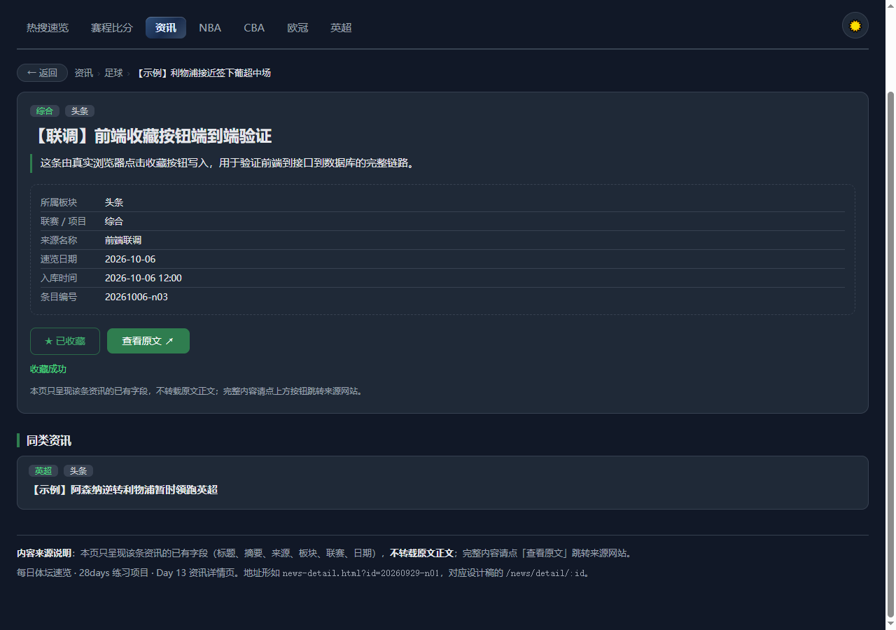
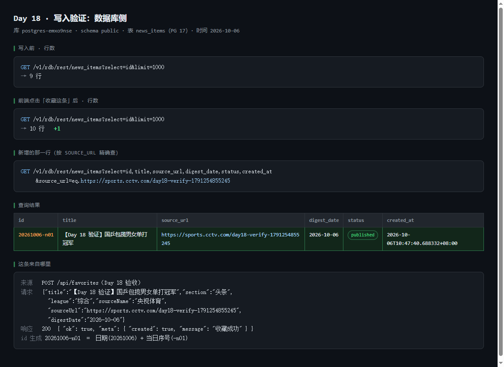

# Day 18 部署手册 · 写入接口 POST /api/favorites 上线

| 项目 | 内容 |
| ---- | ---- |
| 日期 | 2026-10-06（Day 18｜第 3 周第 4 天） |
| 今日掌握项 | **你防了哪一种重复提交或错误输入？怎么测的？** |
| 目标 | 按 `api-contract.md` 实现写入接口 → 部署 → 真实写入 + 读回验证 |
| 结果 | ✅ 全部完成：`POST`/`GET /api/favorites` 已上公网，真库写入并读回，前端 5 个页面接入接口层 |
| 关键依据 | [`api-contract.md`](../api-contract.md) §2.8 / §2.9（本次新增） |
| 上一份 | [`cloudbase-deploy-day17.md`](./cloudbase-deploy-day17.md) |

---

## 0. 今天最关键的一条：一个路由 = 一个云函数

Day 17 只做一个 `/api/hot`，一个函数够用。今天要加 `/api/favorites`，第一反应是「把两个路由塞进同一个函数、在里面自己分辨路径」。**这条路走不通。**

**实测结论**：CloudBase 网关把路由前缀**剥掉**之后再转给云函数——

- 外部请求 `/api/hot` → 函数内收到的路径是 `/`；
- 外部请求 `/api/favorites` → 函数内收到的路径也是 `/`；
- **原始路径不在任何一个请求头里**（逐个请求头 dump 过，没有）。

所以一个函数**无法分辨**自己是被哪个路由调用的。补救办法是「一个路由挂一个函数」：

| 路由 | 云函数 | 服务内容 |
| ---- | ---- | ---- |
| `/api/health` | `health` | 健康检查 |
| `/api/hot` | `api` | 热搜读接口 |
| `/api/favorites` | `favorites` | 收藏写 + 读 |

> 顺带解释一个容易绕晕的点：`/api/favorites` 的 **`POST` 和 `GET` 可以放在同一个函数里**，因为它们靠 **HTTP 方法**区分，不需要靠路径区分。**路径撞车才必须拆函数，方法不同不冲突。**

⚙️ **踩坑记录**：第一次部署时两个路由挂同一函数，函数里写了「按原始路径分发」的逻辑，结果 `isHot` 判定全挂 → 两个路由一起 404。排查用的是临时探测函数（把收到的所有请求头打出来），确认无路径信息后才改成一对一。

---

## 1. 板块① · 写接口实现

### 1.1 文件

| 文件 | 作用 |
| ---- | ---- |
| `cloudfunctions/favorites/index.js` | 收藏接口主逻辑（零依赖，Node 原生 `https` 访问 PG） |
| `cloudfunctions/favorites/scf_bootstrap` | 启动描述文件 |
| `cloudfunctions/favorites/package.json` | `main: index.js`，`engines.node >= 18` |
| `db/schema.sql` | 新增唯一索引 `news_items_source_url_uniq` |
| `cloudbaserc.json` | 新增 `favorites` 函数 + `/api/favorites` 路由 |

### 1.2 接口做什么

一句话：**把详情页看到的那条资讯，写进核心表 `news_items`，同一条不许写两次。**

请求体 7 个字段全必填（`title` / `summary` / `section` / `league` / `sourceName` / `sourceUrl` / `digestDate`），
`status`、`createdAt`、`id` 由服务端生成。完整字段约束见契约 §2.8。

### 1.3 防重：两层，都返回「已存在」而不是报错

这是今天的掌握项，重点说明。

**需求**：同一篇文章重复收藏（或同一天的重复速览），按契约约定「**返回已存在**」，而不是丢一个 409 报错。

**第 1 层 —— 写入前先查**（覆盖绝大多数情况）

```
按 source_url 查一次 → 查到 → 直接返回 200 { meta.created:false, message:"这篇文章已在收藏中" }，不写库
```

**第 2 层 —— 唯一索引兜底**（覆盖并发）

万一两个请求同时通过了第 1 层检查（都还没写进去），两个都会去 INSERT。这时数据库的唯一索引会拦下第二个：

```sql
CREATE UNIQUE INDEX IF NOT EXISTS news_items_source_url_uniq ON public.news_items (source_url);
```

第二个 INSERT 抛 SQLSTATE `23505`（唯一约束冲突）→ 函数捕获这个特定错误码 → **回查那一行** → 同样返回 `200` + `created:false`。

> 为什么两层都要有：只做第 1 层，并发时会有两个 23505 直接冒到用户面前（500）；只做第 2 层，每次都靠报错驱动，日志吵且慢。**两层配合，任何情况下同一 `sourceUrl` 在表里都只有 0 或 1 行。**

⚠️ **SQL 踩坑**：`ALTER TABLE ... ADD CONSTRAINT ... UNIQUE (col)` 通过 tcb CLI 执行时被截断（括号解析问题），改用 `CREATE UNIQUE INDEX IF NOT EXISTS` 一次成功。

### 1.4 字段校验：一次报全部，用中文列清缺什么

校验函数收集**所有**问题后再一次性返回，不是缺一个报一个：

```json
{
  "ok": false,
  "error": {
    "code": "BAD_REQUEST",
    "message": "缺少必填字段：摘要 summary、板块 section、联赛 league、来源名称 sourceName、原文链接 sourceUrl、归属日期 digestDate。请补齐后重新提交。"
  }
}
```

校验项：必填、`digestDate` 格式与**日期真实存在**（`2026-02-30` 要拦）、`section` 白名单、`title` ≤30、`summary` ≤60、`sourceUrl` 必须 `http(s)://`。

⚠️ **时区 bug（测试抓到的）**：`2026-10-06` 一度被误判为非法。原因是 `new Date('2026-10-06T00:00:00').toISOString()` 在东八区会滚到 UTC 的 `2026-10-05T16:00Z`，日期差一天。改成用 `Date.UTC(y, m-1, d)` 比较各分量后正确。

### 1.5 API Key 与鉴权

写入接口同样走 PostgREST HTTP API（体验版不能直连 PG 的 TCP），需要 `CB_API_KEY`：

- Key 存在本地 `.env`（已 gitignore），不进仓库；
- 云函数通过 `cloudbaserc.json` 的 `envVariables` 注入：`CB_ENV_ID` / `CB_API_KEY` 走 `{{env.*}}` 占位；
- 网关路由 `enableAuth: false`（第 3 周接口公开，第 4 周再议鉴权）。

---

## 2. 板块② · 部署

```bash
# 1. 规范启动脚本换行（Windows 上 git 会转 CRLF，会导致函数启动失败）
#    确保 cloudfunctions/favorites/scf_bootstrap 是 LF

# 2. 部署 favorites 云函数（HTTP 型）
tcb fn deploy favorites -e {{env.TCB_ENV_ID}}

# 3. 关键：把 /api/favorites 路由落到网关（只部署函数不配路由会 404）
tcb deploy --only gateway -e {{env.TCB_ENV_ID}}
```

> tcb CLI 在本机需要绕过 `.cmd` 包装（shim 缺 `dirname`/`ls`/`head` 等）：
> `node <npm-global>/node_modules/@cloudbase/cli/bin/tcb ...`，`shell: false`。

### 2.1 部署后核对

| 项 | 期望 |
| -- | ---- |
| 函数列表 | `health` / `api` / `favorites` 三个都在，且 `favorites` 状态正常 |
| 环境变量 | `favorites` 上 `CB_ENV_ID`、`CB_API_KEY` 均已注入（不是空串） |
| 网关路由 | `/api/favorites` → `function:favorites` |

---

## 3. 板块③ · 写入与读回验证

### 3.1 三条测试命令（正常 / 重复 / 缺字段）

把域名抽成变量：

```bash
API=https://ross-d2gimwy406e0d6812-1499705719.ap-shanghai.app.tcloudbase.com
```

**① 正常提交**（应 `200`，`meta.created:true`）

```bash
curl -s -X POST "$API/api/favorites" \
  -H "Content-Type: application/json" \
  -d '{"title":"国乒包揽男女单打冠军","summary":"决赛四比零，男女单打冠军都被拿下。","section":"头条","league":"综合","sourceName":"央视体育","sourceUrl":"https://sports.cctv.com/2026/10/06/tt.html","digestDate":"2026-10-06"}'
```

**② 重复提交**（把上面**一模一样**再打一次 → 应 `200` + `meta.created:false` + 「这篇文章已在收藏中」，`data.id` 与首次相同）

```bash
curl -s -X POST "$API/api/favorites" \
  -H "Content-Type: application/json" \
  -d '{"title":"国乒包揽男女单打冠军","summary":"决赛四比零，男女单打冠军都被拿下。","section":"头条","league":"综合","sourceName":"央视体育","sourceUrl":"https://sports.cctv.com/2026/10/06/tt.html","digestDate":"2026-10-06"}'
```

**③ 缺字段**（只给标题 → 应 `400`，中文点名还缺哪些）

```bash
curl -s -X POST "$API/api/favorites" \
  -H "Content-Type: application/json" \
  -d '{"title":"只有标题"}'
```

### 3.2 数据库 select 验证方法

三种方式，任选：

**A. 控制台 SQL 编辑器**（最直观，适合截图）

```sql
-- 写入前后各跑一次，看行数变化
SELECT count(*) FROM public.news_items;

-- 精确查刚写入的那一行
SELECT id, title, source_url, digest_date, status, created_at
FROM   public.news_items
WHERE  source_url = 'https://sports.cctv.com/2026/10/06/tt.html';

-- 证明防重：同一 source_url 必须只有 1 行
SELECT source_url, count(*) AS 行数
FROM   public.news_items
GROUP  BY source_url
HAVING count(*) > 1;        -- 应返回 0 行
```

**B. 命令行**（本机可用）

```bash
tcb db execute --sql "SELECT count(*) FROM public.news_items" -e {{env.TCB_ENV_ID}}
```

> ⚠️ 单条 `--sql` 超过约 32KB 会报 `Argument list too long`，长脚本要按语句边界切段。
> ⚠️ 不要加 `--json`（会返回 `Rows:["[]"]`），直接解析输出的表格文本。

**C. PostgREST 直查**（和云函数同一条通道）

```bash
curl -s "https://ross-d2gimwy406e0d6812.api.tcloudbasegateway.com/v1/rdb/rest/news_items?select=id,title,source_url&source_url=eq.<URL编码后的链接>" \
  -H "Authorization: Bearer $CB_API_KEY"
```

### 3.3 读回验证（完成标准最后一条）

```bash
curl -s "$API/api/favorites?limit=5"
```

应看到刚写入那条在 `data` 里（按 `createdAt` 倒序，最新的在最前），`meta.count` / `meta.limit` / `meta.offset` 齐全。

### 3.4 本次实测结果（2026-10-06）

| 步骤 | 结果 |
| ---- | ---- |
| 写入前 `news_items` 行数 | **9** |
| 正常 POST | `200` · `created:true` · `id=20261006-n01` |
| 写后行数 | **10**（+1） |
| 按 `source_url` 精确查 | 命中 1 行，字段全对 |
| `GET /api/favorites` | 读回该行 ✅ |
| 重复 POST（同 URL） | `200` · `created:false` · 「这篇文章已在收藏中」，行数仍 **10** |
| 缺字段 POST | `400` · 中文列清 6 个缺失字段 |
| 同 `source_url` 行数 | **1**（防重成立） |

**本地测试套件**：`node scripts_cloudbase/test-api-local.cjs --with-db` → **17/17 全过**
（含 400/404/405/500 各分支、9 条校验用例、4 条真库用例）

> 测试脚本会留下一条记录，脚本结束时会打印清理用的 `DELETE` 语句。

---

## 4. 前端接入接口层（本日额外板块）

按 Day 18 决定「顺手把前端接上」，5 个文件从「只读本地 JSON」改成「**先打接口、失败降级本地**」：

| 文件 | 接口 | 降级 |
| ---- | ---- | ---- |
| `js/news.js` | `GET /api/news` | `data/news.json` |
| `js/news-detail.js` | `GET /api/news` + **`POST /api/favorites`** | `data/news.json` |
| `js/app.js` | `GET /api/news` | `data/news.json` |
| `js/matches.js` | `GET /api/matches` | `data/matches.json` |
| `js/league.js` | `GET /api/leagues/:id` | `data/<lg>.json` |

### 4.1 两个必须遵守的写法

**① 地址用绝对域名**（不能用相对路径 `/api/xxx`）

```js
const FUNC_ORIGIN = 'https://ross-d2gimwy406e0d6812-1499705719.ap-shanghai.app.tcloudbase.com';
```

前端在**静态托管域名**（`...tcloudbaseapp.com`），接口在**云函数网关域名**（`...app.tcloudbase.com`）——**不同域**。相对路径会打到静态托管自己身上（404 → 一律降级）。本地预览也没有 `/api` 路由。

**② 解包络**

```js
const body = await res.json();
if (!body || body.ok !== true) throw new Error(body?.error?.message || '接口返回异常');
const data = body.data;      // ← 原来直接是数组，现在要取 .data
```

### 4.2 字段名本轮不改（与原计划有出入，已回写契约）

契约 §0.1 原写「Day 18 迁移前端时把旧字段一并改名（蛇形→驼峰）」。**实际执行时决定不改**：

- `/api/news`、`/api/matches`、`/api/leagues/:id` 今天都没实现，改完只能靠本地 JSON 兜底，**测不出真实收益**；
- 要动 100+ 处取值，风险与收获不成比例；
- 已上线的两个接口（`/api/hot`、`/api/favorites`）本来就是 camelCase，不受影响。

→ **改名推迟到各读接口真正上线那天，跟着对应文件一起改。** 契约 §0.1 已补执行说明。

### 4.3 收藏按钮

详情页动作区新增「收藏这条」按钮（`js/news-detail.js` + `css/news.css`）：

- 点击 → `POST /api/favorites`，payload 显式映射成契约的 camelCase（页面数据仍是蛇形，转换在 `favoritePayload()` 里）；
- `meta.created:true` → 按钮变 `★ 已收藏` + 绿字「收藏成功」；
- `meta.created:false` → 按钮变 `★ 已在收藏中` + 「这篇文章已在收藏中」（**不是错误态**）；
- 请求中禁用按钮防连点（`favBusy` 锁）；
- 失败/异常 → 红字提示，按钮恢复可点。

**真实浏览器验证**（agent-browser + 本地静态服务）：

| 检查 | 结果 |
| ---- | ---- |
| 列表页/详情页渲染 | ✅ 正常，无白屏（走降级分支） |
| 按钮存在 | ✅ `☆ 收藏这条`，与「查看原文 ↗」并排 |
| 点击 → 请求体 | ✅ camelCase 7 字段正确 |
| 点击 → 响应 | ✅ `200 created:true` |
| 点击 → 界面 | ✅ `★ 已收藏` + 「收藏成功」 |
| DB 行数 | ✅ 9 → 10 |
| 再点一次 | ✅ 「这篇文章已在收藏中」，行数不变 |

> ⚠️ **工具坑**：agent-browser 的 `click <selector>` 命令在页面上不派发事件（点了没反应），
> 但用 `eval` 里的 `element.click()` 正常。验证交互时用后者。
> 判断依据：先用 `eval` 手动调 `submitFavorite()` 能拿到 200，说明代码没问题、是工具没点下去。

---

## 5. 服务端日志（余力加练）

每个事件打一行 JSON，方便以后排查：

```json
{"ts":"2026-10-06T03:55:13.645Z","event":"favorites.create.ok","id":"20261006-n04","title":"...","section":"头条","digestDate":"2026-10-06","ms":561}
```

事件名：`boot` / `favorites.create.ok` / `favorites.create.duplicate` / `favorites.create.reject` / `favorites.list.ok` / `method_not_allowed` / `not_found` / `error`。
单行是为了能在 CloudBase 日志检索里直接按 `event` 过滤。

---

## 6. 今天还差什么

| 项 | 状态 |
| ---- | ---- |
| `POST` / `GET /api/favorites` | ✅ 已实现并上公网 |
| 部署 + 网关路由 | ✅ 已完成 |
| 真实写入 + 读回验证 | ✅ 已完成（9→10 行，读回命中） |
| 防重（两层） | ✅ 已实现并验证 |
| 中文错误信息 | ✅ 9 条校验用例全过 |
| 前端接入（5 文件）+ 收藏按钮 | ✅ 已完成并浏览器验证 |
| 服务端日志（加练） | ✅ 已完成 |
| 两张截图 | ✅ 已产出（见下） |
| `PATCH` / `DELETE` | ❌ 第 4 周 |
| 批量写入 | ❌ 今日明确不做 |
| 跨域配置 | ❌ Day 20 |

### 6.1 今日截图

| # | 内容 | 文件 |
| - | ---- | ---- |
| 1 | POST 成功返回 + 页面反馈（`★ 已收藏` / 「收藏成功」） | [`docs/day18-post-success.png`](./day18-post-success.png) |
| 2 | 数据库新增行（行数 9→10 + 该行明细） | [`docs/day18-db-row.png`](./day18-db-row.png) |





---

## 7. 排查顺序（卡住时）

1. **404** → 网关路由配了吗？`tcb deploy --only gateway` 跑了吗？`cloudbaserc.json` 里 `/api/favorites` 指向 `function:favorites` 吗？
2. **500 且日志说 Key 为空** → 云函数环境变量 `CB_API_KEY` 注入了吗？
3. **500 且是 SQL 报错** → 唯一索引建了吗？表在 `public` schema 吗？（`auth`/`storage` 是系统 schema，别动）
4. **重复提交返回 409 而不是 200** → 第 2 层没接住 `23505`，检查错误码判断。
5. **前端一直走降级** → 打开控制台看 `[news.js] 接口 /api/news 不可用` 后面跟的错；多半是 `/api/news` 还没实现（**这是预期行为**），或域名写错。
6. **按钮点了没反应** → 先用 `eval` 调 `submitFavorite()` 区分「代码问题」还是「工具没点下去」。
