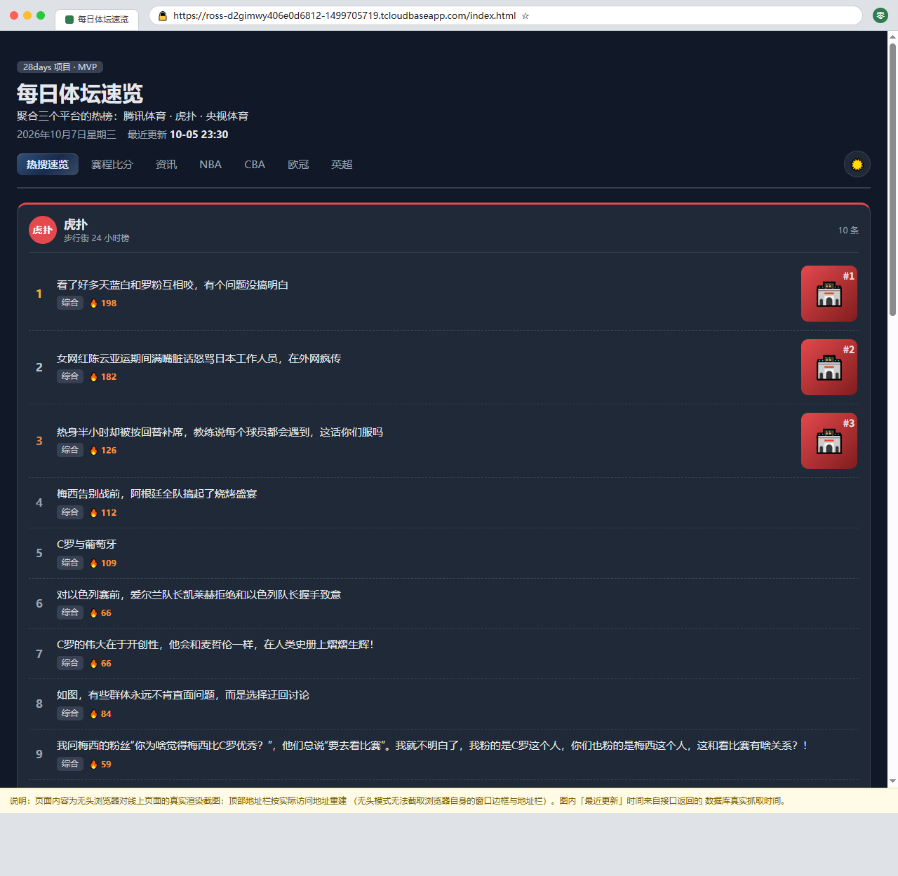
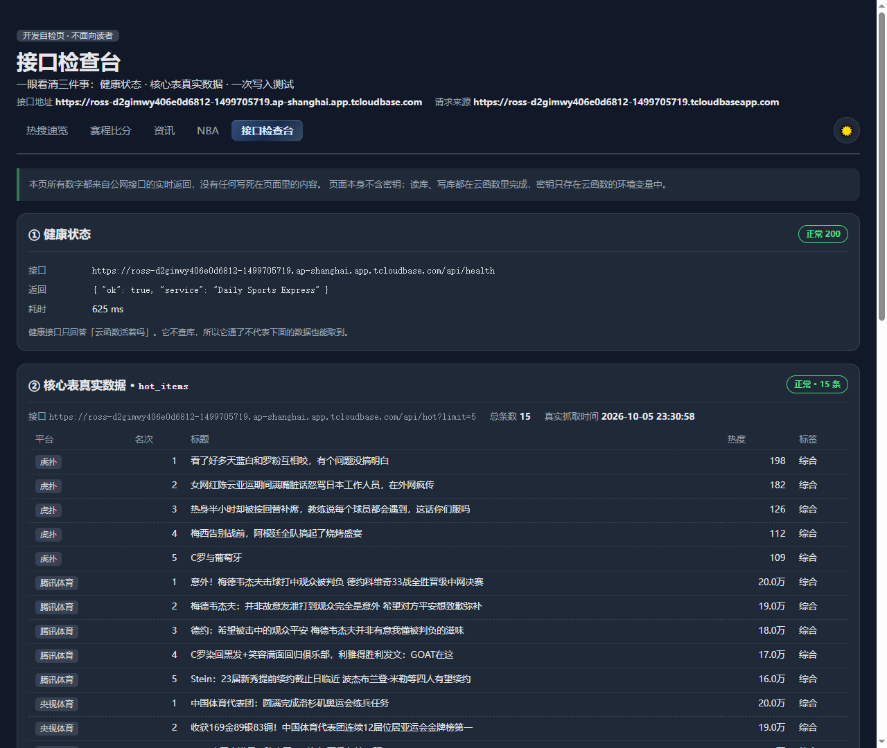
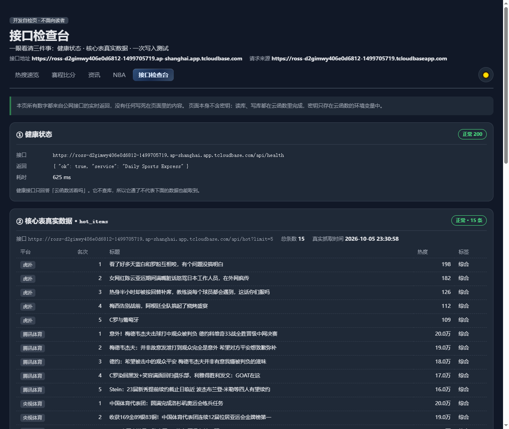

# Day 20 部署手册 · 前端切公网接口 + 跨域确认 + 接口检查台

| 项目 | 内容 |
| ---- | ---- |
| 文档名称 | Day 20 部署手册（前端从 mock 切真实接口 → 配置/确认跨域 → 重新部署 → 逐项验证） |
| 撰写日期 | 2026-10-07（Day 20｜第 3 周） |
| 对应任务 | ① 确认云函数可用并配置跨域 · ② 本地接线 · ③ 重新构建上传 · ④ 逐项验证 |
| 今日边界 | **不做**：从零重新部署、改后端业务代码（只加了「读真实抓取时间」一处小改） |
| 完成标准 | ① 公网首页展示数据库真实数据 ② 控制台改数据刷新跟着变 ③ F12 里请求地址是公网地址 |

**公网地址（今日交付）**

| 页面 | 地址 |
| ---- | ---- |
| 首页 | https://ross-d2gimwy406e0d6812-1499705719.tcloudbaseapp.com/index.html |
| 接口检查台（今日新增） | https://ross-d2gimwy406e0d6812-1499705719.tcloudbaseapp.com/checkup.html |
| 接口网关 | `https://ross-d2gimwy406e0d6812-1499705719.ap-shanghai.app.tcloudbase.com/api/*` |

---

## 0. 一句话结论

> Day 19 之前，前端一直在读本地 `data/*.json`（示例数据）。今天把它**改成打公网接口**，
> 并把「跨域到底配没配、配得对不对」这件事**实测清楚**，然后重新部署、逐项验证。
> 结果是：**公网首页展示的就是数据库里的真实热搜**，F12 里请求打的是 `...app.tcloudbase.com/api/hot`（200），
> 并且新增了一个「接口检查台」页，把健康状态、核心表真实数据、写入测试三件事放在一个页面上。

**验收三问的答案**：

| 完成标准 | 结果 | 证据 |
| ---- | ---- | ---- |
| ① 公网首页展示数据库真实数据 | ✅ | 首页三平台 10/7/7 条真实热搜，首条是真实虎扑帖；`docs/day20-public-home.png` |
| ② 控制台改数据、刷新跟着变 | ✅ | 检查台写入测试：新写 1 条 → 回读列表第 1 行变成新数据；`docs/day20-public-write.png` |
| ③ F12 里请求地址是公网地址 | ✅ | 网络面板：`GET https://ross-…app.tcloudbase.com/api/hot` → 200（非 localhost、非相对路径） |

---

## 1. 板块① · 云函数可用性确认 + 跨域现状（实测）

### 1.1 结论先说

> **今天这一步的产出是「确认」，不是「新增配置」。**
> 跨域白名单在 Day 15 开通静态托管时就**自动写入了本项目域名**，今天实测确认它**生效且没有用 `*` 通配符**。
> 唯一没做到的是「把本地域名也加进白名单」——**体验版套餐不允许**，所以本地开发改用同源代理（见 §2.2）。

### 1.2 白名单现状（`tcb cors list -e ross-d2gimwy406e0d6812`）

| Domain ID | Domain | 状态 | 说明 |
| ---- | ---- | ---- | ---- |
| `04684353-…` | `ross-d2gimwy406e0d6812-1499705719.tcloudbaseapp.com` | Enabled | **本项目静态托管域名**（2026-10-03 写入） |
| 1–6 | `weda/tcb.cloud.tencent.com(.cn/.com.cn)` | Enabled | 腾讯云官方，系统默认 |
| 7 | `*.preview.cloudbase.net` | Enabled | 预览域名，系统默认 |
| 8 | `*.webapps.tcloudbase.com` | Enabled | 系统默认 |
| 9 | `docs.cloudbase.net` | Enabled | 系统默认 |
| 10 | `tcb.tencentcloud.com` | Enabled | 系统默认 |

- **没有 `*` 通配符**（符合清单要求「只允许自己的域名」）。
- 白名单是**精确匹配**：只有列出的域名会被放行。

### 1.3 跨域行为实测（带不同 `Origin` 直接打网关）

| 请求 Origin | HTTP | `access-control-allow-origin` 响应头 | 浏览器能否读到响应 |
| ---- | ---- | ---- | ---- |
| `https://ross-d2gimwy406e0d6812-1499705719.tcloudbaseapp.com`（白名单内） | 200 | **回显该域名** | ✅ 能 |
| `https://evil.example.com`（白名单外） | 200 | **完全不返回该头** | ❌ 不能（浏览器拦下） |
| 预检 `OPTIONS /api/favorites`（带白名单内 Origin） | **204** | 回显 | ✅ 能 |

> 关键点：白名单外的请求服务端**也返回 200**，但**不带 ACAO 头**——跨域拦截是浏览器执行的。
> 所以「用 curl 打能通」不等于「跨域配好了」，判断依据要**看响应头**，不能只看状态码。

### 1.4 体验版限制：本地域名加不进白名单

```bash
tcb cors add localhost:8000,127.0.0.1:8000 -e ross-d2gimwy406e0d6812
# → 报错：当前套餐无法执行此操作
```

**处理方式**：本地开发不依赖白名单，改成 **`serve.mjs` 提供 `/api/*` 同源代理**（§2.2）。
页面在本地走相对路径 `/api/hot`，由本地服务转发到公网网关——**同源，不产生跨域**，也不需要往白名单里加任何东西。

---

## 2. 板块② · 本地接线（把 mock 换成接口）

### 2.1 接口地址唯一出处：`js/api-config.js`（新建）

以前接口地址散在各文件里，今天收口到一个文件：**页面只读 `window.API_ORIGIN`，不再自己拼域名**。

```js
// 本地预览（localhost / 127.0.0.1 / 局域网）→ 空字符串，走相对路径 /api/*
// 线上（静态托管域名）→ 直接指向云函数网关绝对地址
```

| 环境 | `window.API_ORIGIN` | 实际请求地址 | 跨域 |
| ---- | ---- | ---- | ---- |
| 本地 `localhost:8001` | `''` | `/api/hot` → 打到本地 server | 同源，无跨域 |
| 线上静态托管 | `https://ross-…app.tcloudbase.com` | 绝对地址直连网关 | 网关按白名单放行 |

> 为什么线上必须用**绝对地址**：页面在 `…tcloudbaseapp.com`，接口在 `…app.tcloudbase.com`，**两个域名**；
> 相对路径会打到静态托管自身（没有 `/api` 路由）→ 404。这是 Day 17 §3.4 踩坑 5 的延续，今天把它抽成配置项。

### 2.2 本地同源代理：`serve.mjs` 新增 `/api/*` 转发

本地跑 `node serve.mjs 8001` 时，凡以 `/api/` 开头的请求，由本地服务用 Node 原生 `https`
转发到公网网关（**转发前去掉 `Origin` / `Referer` 头**，避免本地域名触发白名单校验失败）：

```
浏览器 → http://localhost:8001/api/hot（同源）
        → serve.mjs 转发 → https://ross-…app.tcloudbase.com/api/hot（公网网关）
```

好处：本地页面代码**与线上完全一致**（都写 `apiUrl('/api/hot')`），不需要为本地另写一套地址。

### 2.3 本地验证结果（真实浏览器，agent-browser 实测）

| 检查项 | 实测值 |
| ---- | ---- |
| 首页更新时间 | `10-07 18:24`（接口返回的真实抓取时间） |
| mock 字样 | 无（`hasMockWord: false`） |
| 三平台卡片 | 3 张，含真实虎扑数据 |
| 检查台 health | 200 |
| 检查台 hot | 15 条，抓取时间真实 |
| 检查台 news | 5 条 |

---

## 3. 板块③ · 重新构建上传

### 3.1 静态托管：`scripts_cloudbase/build-publish.mjs`（新建，替代 Day 15 的 .ps1）

Day 15 用的是 `deploy-hosting.ps1`，本机实测跑不通（套壳 PowerShell 会重置工作目录、`$PSScriptRoot` 取到空值）。
换成 Node 实现（零依赖、跨平台，项目里本来就用 Node 跑 `serve.mjs`）：

```bash
node scripts_cloudbase/build-publish.mjs
# → .cloudbase-publish/（根目录 *.html + css/ + js/ + data/）
tcb hosting deploy .cloudbase-publish -e ross-d2gimwy406e0d6812 --safe
```

只发布「浏览器要的东西」：**文档（`*.md`）、云函数源码、`db/`、`skills/` 一概不上传**。

本次实测：**28 个文件上传成功**（6 个 html + 5 个 css + 9 个 js + 7 个 data + `checkup.html` 等）。

### 3.2 ⚠️ 云函数：一个必须修的打包坑（今天最大的技术发现）

**现象**：`tcb fn deploy api --httpFn -e <envId>` 显示部署成功，但公网接口返回
`x-cloudbase-upstream-status-code: 443` + `content-length: 0`（curl 看到 200 空 body）。

**根因**（查 CLI 3.8.5 源码确认）：CLI 的 `FunctionPacker` 打包时，
**压缩包根目录 = 函数目录本身**：

```js
// CloudBase CLI 源码（FunctionPacker）
this.funcPath = functionPath ? functionPath : path.resolve(root, name);
zipDir(this.funcPath, ...);
```

Day 19 把「查数据库」抽到 `cloudfunctions/shared/` 后，`cloudfunctions/api/index.js` 里写的是
`require('../shared/pg')` —— 而 `shared/` **永远在压缩包外**，函数一启动就
`Cannot find module '../shared/pg'` 直接退出 → 网关回 443 空响应。

> ⚠️ **更正 Day 19 的记录**：当时记的「用 `-r` 参数以项目根为根目录部署」是**错的**。
> 本机 `tcb deploy --help` 里没有 `-r`；`--dir` 只能指定**单个函数目录**，不能换个根。

**解法**：`scripts_cloudbase/build-functions.mjs`（新建）为每个函数生成**自包含部署目录**：

```
.cloudbase-build/<函数名>/
├── index.js        ← 从 cloudfunctions/<函数名>/ 拷来
├── package.json
├── scf_bootstrap
└── shared/         ← 从 cloudfunctions/shared/ 整份拷来
```

并把**拷贝件**里的 `require('../shared/x')` 改写成 `require('./shared/x')`
（正则 `/require\((['"])\.\.\/shared\//g`）。**源码保持原样**，本地 `node cloudfunctions/api/index.js` 照样跑得通。

```bash
node scripts_cloudbase/build-functions.mjs
tcb fn deploy api       --httpFn --dir .cloudbase-build/api       -e <envId> --force
tcb fn deploy favorites --httpFn --dir .cloudbase-build/favorites -e <envId> --force
tcb deploy --only gateway -e <envId>        # 路由无变化时显示「跳过」
```

> `.cloudbase-build/` 与 `.cloudbase-publish/` 都已加进 `.gitignore`。

### 3.3 部署后要等冷启动

`tcb fn deploy` 成功后**公网接口不会立刻恢复**，实测要等 **约 40–60 秒**（首次请求仍 443，之后才 200 + 真实数据）。
不是部署失败，别急着重推。

---

## 4. 板块④ · 逐项验证（今天的截图）

### 4.1 检查清单

| # | 检查项 | 期望 | 实测 |
| - | ---- | ---- | ---- |
| 1 | 公网首页可打开 | 200 | ✅ |
| 2 | 首页显示数据库真实数据 | 三平台真实热搜 | ✅ 虎扑 10 / 腾讯体育 7 / 央视体育 7 |
| 3 | 首页副标题写明三平台 | 「聚合三个平台的热榜：腾讯体育 · 虎扑 · 央视体育」 | ✅ |
| 4 | 首页无 mock / 示例数据字样 | 无 | ✅ `hasMockWord: false` |
| 5 | 「最近更新」显示的是**接口返回的真实抓取时间** | 不是渲染时刻 | ✅ `10-05 23:30`（库中 `fetched_at` 最大值） |
| 6 | 请求地址为公网地址 | `…app.tcloudbase.com/api/hot` | ✅ 200，非 localhost、非相对路径 |
| 7 | 检查台 health | 200 | ✅ 625 ms |
| 8 | 检查台 hot 表真实数据 | 有行 | ✅ 15 条 + 真实抓取时间 |
| 9 | 检查台 news 表真实数据 | 有行 | ✅ 5 条 |
| 10 | 写入测试（POST） | 200 + 新写入 | ✅ POST 200 / 预检 204，回读第 1 行变成新数据 |
| 11 | 跨域放行 | 白名单内域名有 ACAO 头 | ✅ 无 `*` |
| 12 | 部署配置无硬编码密钥 | 密钥只在环境变量 | ✅ 见 §6.2 |

### 4.2 首页 · 公网真实数据（截图 1）



> 图内页面内容为**无头浏览器对线上页面的真实渲染截图**；顶部地址栏按实际访问地址重建
> （无头模式截不到浏览器自身的地址栏），并已在图内标注说明。
> 可以看到：完整公网 URL、三平台副标题、`最近更新 10-05 23:30`、真实虎扑热帖。

### 4.3 接口检查台（截图 2）



| 区块 | 内容 |
| ---- | ---- |
| ① 健康状态 | `/api/health` → 正常 200（625 ms） |
| ② 核心表真实数据 | `hot_items` 15 条 + **真实抓取时间** `2026-10-05 23:30:58`；`news_items` 5 条 |
| ③ 写入测试 | 表单 POST `/api/favorites`，提交后自动读回验证 |
| ④ 跨域放行说明 | 白名单域名 + 无 `*` 的说明 |
| 页面顶部 | 接口地址（`API_ORIGIN`）与当前页面域名，**一眼看出请求打的是哪** |

### 4.4 写入测试 · 证明数据是活的（截图 3）



```
POST https://ross-…app.tcloudbase.com/api/favorites   耗时 344 ms
{ "ok": true, "data": { "id": "20261007-n01", "title": "Day 20 检查台写入测试", … },
  "meta": { "created": true, "message": "收藏成功" } }
```

回读：`news_items` 列表第 1 行变成「Day 20 检查台写入测试」——**写进去的数据能立刻读出来**，
这条链路（页面 → 网关 → 云函数 → PG → 回读）是通的。

### 4.5 请求地址证据（F12 网络面板，从真实浏览器导出）

```
GET  https://ross-…tcloudbaseapp.com/index.html          (Document) 200
GET  https://ross-…tcloudbaseapp.com/js/api-config.js    (Script)   200
GET  https://ross-…app.tcloudbase.com/api/hot            (Fetch)    200   ← 公网接口
--- 检查台 ---
GET  https://ross-…app.tcloudbase.com/api/health         (Fetch)    200
GET  https://ross-…app.tcloudbase.com/api/hot?limit=5    (Fetch)    200
GET  https://ross-…app.tcloudbase.com/api/favorites?limit=5 (Fetch) 200
POST https://ross-…app.tcloudbase.com/api/favorites      (Fetch)    200
OPTIONS https://ross-…app.tcloudbase.com/api/favorites   (Other)    204   ← 预检
```

> 注：第一次打开时 `index.html` 有一次 404，是 CloudBase 测试域名的**「风险提醒」拦截页**所致
> （点「确定访问」后才进真页面），不是页面本身 404。

---

## 5. 发给同伴的验证说明（直接复制）

> 帮我点开这两个链接看看能不能打开、有没有内容（手机电脑都行）：
>
> 1. 首页：https://ross-d2gimwy406e0d6812-1499705719.tcloudbaseapp.com/index.html
>    应该看到「每日体坛速览」，下面三块榜单：虎扑、腾讯体育、央视体育，每块都是具体的热搜标题。
>
> 2. 接口检查台：https://ross-d2gimwy406e0d6812-1499705719.tcloudbaseapp.com/checkup.html
>    应该看到三个绿标：健康状态正常、热搜表有数据、资讯表有数据。
>
> 如果第一次打开出现「风险提醒」页，点页面上的「确定访问」就能进。
> 打不开或显示空白的话，把截图发我，我这边查。

---

## 6. 最可能卡住的三个地方（提前备好）

### 6.1 跨域（CORS）

| 现象 | 先查什么 |
| ---- | ---- |
| 浏览器控制台报 `blocked by CORS policy`、`No 'Access-Control-Allow-Origin'` | 请求的 `Origin` 是不是**页面的真实域名**（`…tcloudbaseapp.com`）。白名单是精确匹配，`www.` 前缀、http/https、端口不同都算不同源 |
| 白名单外域名也想调 | **不要加 `*`**。要加就把确切域名加进白名单：`tcb cors list / add / remove -e <envId>` |
| 本地 `localhost` 调不通 | 体验版**加不进**本地域名（§1.4）。用 `serve.mjs` 本地服务走 `/api` 同源代理，别硬加白名单 |
| 用 curl 测是通的，浏览器却报跨域 | 正常——跨域拦截在**浏览器**那一层。判断依据看**响应头有没有 ACAO**，不是看状态码 |

### 6.2 环境变量

| 现象 | 先查什么 |
| ---- | ---- |
| 接口返回 500 +「服务端未配置 API Key」 | 云函数环境变量 `CB_API_KEY` 没配 / 没生效；**改完要重新 `tcb fn deploy`** |
| 配了但 `tcb fn detail api` 里是 `None` | `cloudbaserc.json` 的字段名必须是 **`envVariables`**（不是 `environmentVariables`）——Day 17 踩过 |
| 担心密钥进了仓库 | 检查：`git grep -n "CB_API_KEY"` 只应出现在**文档/配置声明**里，**不应出现真实 Key 值**。云函数读 `process.env.CB_API_KEY`，前端**完全接触不到**这个 Key |
| 数据库返回 401 | Key 错了 / 过期了，去控制台重建 |

**本次确认（完成标准「所有密钥走环境变量、部署配置无硬编码」）**：

- 云函数侧：`CB_API_KEY` / `CB_ENV_ID` 走**云函数环境变量**（`cloudbaserc.json` 只声明变量名，不含值）；
- 前端侧：页面**不持有任何密钥**，只打公开接口（`enableAuth: false` 的读接口）；
- 仓库侧：`.env`、`.cloudbase-build/`、`.cloudbase-publish/` 均已 gitignore。

### 6.3 构建 / 打包报错

| 现象 | 先查什么 |
| ---- | ---- |
| 部署成功但公网返回 **443 空响应**（`content-length: 0`） | 函数包缺 `shared/`：**必须用 `build-functions.mjs` 生成的自包含目录部署**（§3.2），不要直接 `tcb fn deploy api` |
| 函数部署成功但访问超时 | `scf_bootstrap` 被 git 转成 CRLF 了 → 跑 `node scripts_cloudbase/normalize-eol.mjs` 后重部署 |
| 静态页面改了但线上没变 | CDN 缓存：验证时加 `?v=时间戳` 强刷；`tcb hosting deploy … --safe` 已带安全模式 |
| 页面显示的是本地备用数据 | 接口不可用降级了（页面会显式显示橙色提示条「接口暂时不可用，本页显示的是本地备用数据」），先查接口本身通不通 |
| `tcb hosting deploy` 上传了不该上传的文件 | 别直接部署项目根目录，先 `build-publish.mjs` 生成 `.cloudbase-publish/` 再传 |

---

## 7. Day 20 改动文件清单

| 文件 | 状态 | 说明 |
| ---- | ---- | ---- |
| `js/api-config.js` | **新增** | 接口地址唯一出处（本地/线上自动切换） |
| `checkup.html` | **新增** | 接口检查台页 |
| `css/checkup.css` | **新增** | 检查台样式（沿用全站变量体系） |
| `js/checkup.js` | **新增** | 检查台逻辑（health / hot / news / 写入测试） |
| `scripts_cloudbase/build-publish.mjs` | **新增** | 组装静态托管发布目录（替代 Day 15 的 .ps1） |
| `scripts_cloudbase/build-functions.mjs` | **新增** | 组装云函数自包含部署目录（修 `../shared` 打包坑） |
| `index.html` | 改 | 加三平台副标题；页脚去掉 mock 字样、加检查台入口；引入 `api-config.js` |
| `js/home.js` | 改 | 接口地址改读 `API_ORIGIN`；更新时间改用接口真实抓取时间；降级时显示显式提示条 |
| `css/home.css` | 改 | 新增 `.brand-sub` / `.source-note` 样式 |
| `serve.mjs` | 改 | 新增 `/api/*` 本地同源代理 |
| `cloudfunctions/api/index.js` | 改 | `/api/hot` 的 `meta.updatedAt` 改用库里真实 `fetched_at` |
| `cloudfunctions/shared/hotItemsRepository.js` | 改 | 新增 `latestFetchedAt()` |
| `scripts_cloudbase/test-api-local.cjs` | 改 | 新增断言：`updatedAt` 是真实抓取时间 |
| `.gitignore` | 改 | 忽略 `.cloudbase-build/` |

---

## 8. 遗留

| # | 事项 | 说明 |
| - | ---- | ---- |
| 1 | **Day 19 提交未推送** | 本地 HEAD `27a8031`，远端仍 `e47237a`（Day 19 推送因代理单点故障失败）。Day 20 的提交叠在其上，零推送时会一起上去 |
| 2 | `digest.html` 孤页 | Day 8 迁出，仍无导航入口，等零拍板去留 |
| 3 | 本地域名进不了 CORS 白名单 | 体验版限制，已用同源代理绕过，不影响交付 |
